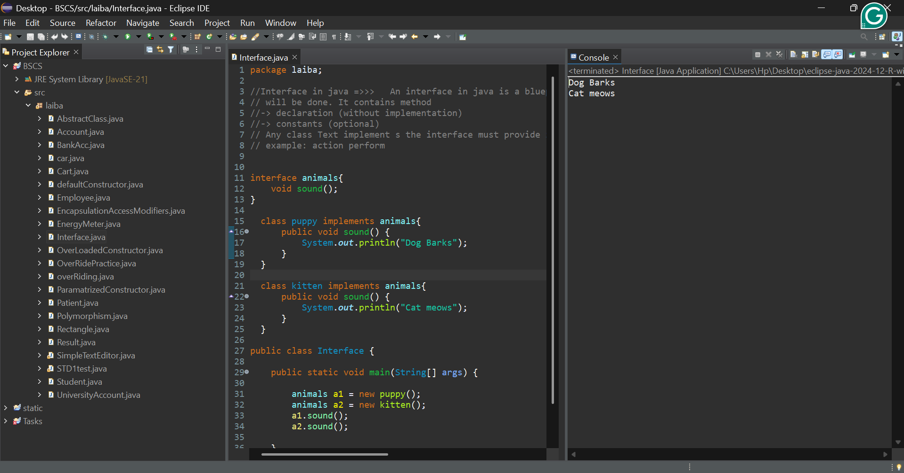

# 🐾 Java Jungle: The Interface Chronicles

Today, I tackled **Interfaces**—the "legal contracts" of the programming world. 

### 💡 What I Learned Today
An interface is like a rulebook. If a class (like `puppy`) signs the contract (`implements animals`), it **must** perform the actions required (like `sound()`). No exceptions!

### 📸 Code in Action
Here is a look at my workspace where the magic happens:

### 🛠️ Featured Snippet: The Animal Talk
In this session, I created a universal `animals` interface. 
- The **Puppy** implementation says: *"Dog Barks"*
- The **Kitten** implementation says: *"Cat meows"*

Even though they are different animals, I can treat them both as `animals` thanks to **Polymorphism**!

